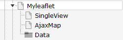
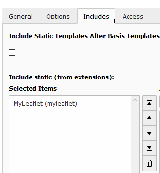

.. ==================================================
.. FOR YOUR INFORMATION
.. --------------------------------------------------
.. -*- coding: utf-8 -*- with BOM.

.. include:: ../Includes.txt

.. _admin-manual:

Administratormanual
====================

Target group: **Administrators**

Installation
^^^^^^^^^^^^
Import the  extension from TER (TYPO3 Extension Repository) like any other extension.
Create some pages as shown below.

On page 'Ajax Map' install plugin MyLeaflet (Map). Make sure you have installed jQuery on *top* of the page.

On page 'myleaflet' or on your root page insert 'Typoscript Include static' (from extension) MyLeaflet (myleaflet).
With the constant editor insert the desired settings of the extension like storage Pid, your page ID's, 
jQuery options, path to templates etc.

The data of tt_address and sys_categories is stored in page Data. Insert in the constant editor
the correct "Default storage PID" of the tt_address records.

Then insert at least one sys_category in the page Data. Now insert some tt_address data records with latitude and longitude values and
assign them to sys_categories. The extension did not fetch the coordinates by itself like the mymap extension.

To use your own mapIcons insert your mapIcons into the directory fileadmin/ext/myleaflet/Resources/Public/Icons.
Insert in this directory your icons which then can be selected in your tt_address data records.

When everything is ok - test it...

Inserting data
^^^^^^^^^^^^^^
In TYPO3 list module select page Data. First insert some sys_categories.
Then you can insert some tt_address data records. You have not to insert the coordinates. If you don't insert some icon, the extension uses a default icon for the 
POI's.

When everything is done you can start a search in frontend.

Reference
^^^^^^^^^

.. _plugin-tx-myleaflet:

plugin.tx\_myleaflet.view
^^^^^^^^^^^^^^^^^^^^^^^^^

templateRootPath
""""""""""""""""

.. container:: table-row

   Property
         templateRootPath

   Data type
         string

   Description
         path to templates

   Default
         EXT:myleaflet/Resources/Private/Templates/

partialRootPath
""""""""""""""""

.. container:: table-row

   Property
         partialRootPath

   Data type
         string

   Description
         path to partials

   Default
         EXT:myleaflet/Resources/Private/Partials/
     
layoutRootPath
""""""""""""""

.. container:: table-row

   Property
         layoutRootPath

   Data type
         string

   Description
         path to layouts

   Default
         EXT:myleaflet/Resources/Private/Layouts/

     
includejQueryCore
"""""""""""""""""

.. container:: table-row

   Property
        includejQueryCore

   Data type
         int

   Description
         include the jQuery library of myleaflet

   Default
        0

plugin.tx\_myleaflet.settings
^^^^^^^^^^^^^^^^^^^^^^^^^^^^^

detailsPageId
"""""""""""""

.. container:: table-row

   Property
        detailsPageId

   Data type
         int

   Description
         Id of the details page

   Default
        -

singleViewUid
"""""""""""""

.. container:: table-row

   Property
        singleViewUid

   Data type
        int

   Description
        Uid of the location record to be shown with the single view plugin.

   Default
        1

resultLimit
"""""""""""

.. container:: table-row

   Property
        resultLimit

   Data type
        int

   Description
        Limit the result to n records

   Default
        300

initialMapCoordinates
"""""""""""""""""""""

.. container:: table-row

   Property
        initialMapCoordintes

   Data type
         string

   Description
         Initial map coordinates [latitude,longitude]

   Default
        48,8

categorySelectMode
""""""""""""""""""

.. container:: table-row

   Property
        categorySelectMode

   Data type
         string

   Description
         The mode of selection of categories [AND|OR]

   Default
        OR

enableMarkerClusterer
"""""""""""""""""""""

.. container:: table-row

   Property
        enableMarkerClusterer

   Data type
         boolean

   Description
         If set, enables the clustering of locations

   Default
        0

Known problems
^^^^^^^^^^^^^^

*No map loaded - ReferenceError: $ is not defined*

Make sure, you have loaded the jQuery on top of the page. This can be done with the constant editor of TYPO3 and the myleaflet
category (plugin.tx_myleaflet.view.includejQueryCore).

FAQ
^^^

*Custom templates and files*

You can use your own template and CSS file or other jQuery library - just go to the TYPO3 constants editor and change
the values for your needs.
