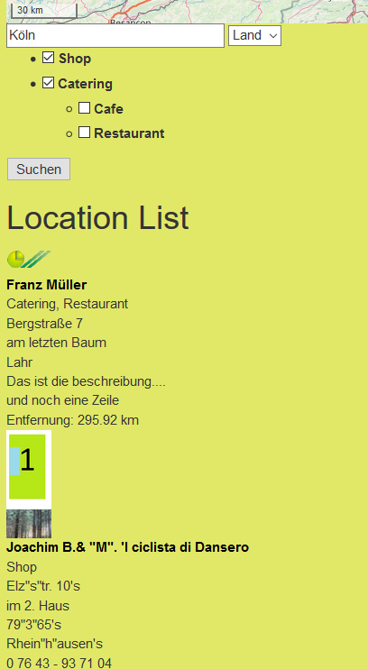
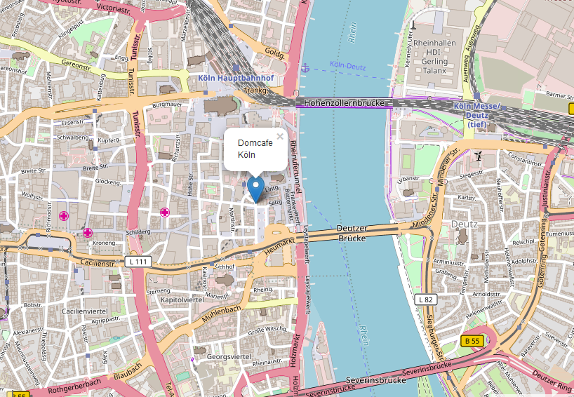

.. ==================================================
.. FOR YOUR INFORMATION
.. --------------------------------------------------
.. -*- coding: utf-8 -*- with BOM.

.. include:: ../Includes.txt

What does it do?
================

The extension enables you to show tt_address locations in responsive Leaflet maps. There are no registration and no API-keys necessary!
You can do a radial search for locations and display them in a list and a responsive Leaflet map with infoWindows.

For the geocoding, the extension uses https://nominatim.openstreetmap.org which is limited to 1 request per second. This may
change in the future...

In template AjaxSearch.html you can set other map types. You can find openstreetmap providers at
http://leaflet-extras.github.io/leaflet-providers/preview/

A single view of the location is implemented, the ajaxSearchResultList items are linked to the single view which shows just a map with one marker.
This can be used also to display just a map without doing a search when the locationUid is given
in the constants of myleaflet with the constant editor of TYPO3. 

What's new?
^^^^^^^^^^^
New configuration option "categorySelectMode" implemented -> see administratormanual. 
Mapicon handling changed. You have to create the directories fileadmin/ext/myleaflet/Resources/Public/Icons.
Insert here your mapIcons. These icons can then be selected in the tt_address record (leafletmapicon).
The templates AjaxSearch.html and Show.html changed.

Screenshots
^^^^^^^^^^^

**MyLeafletMap (Map) result** 

.. image:: ../Images/Introduction/AjaxSearch1.png
	:width: 500px
	:alt: Ajax Search Result

    

**DetailsView**

	
